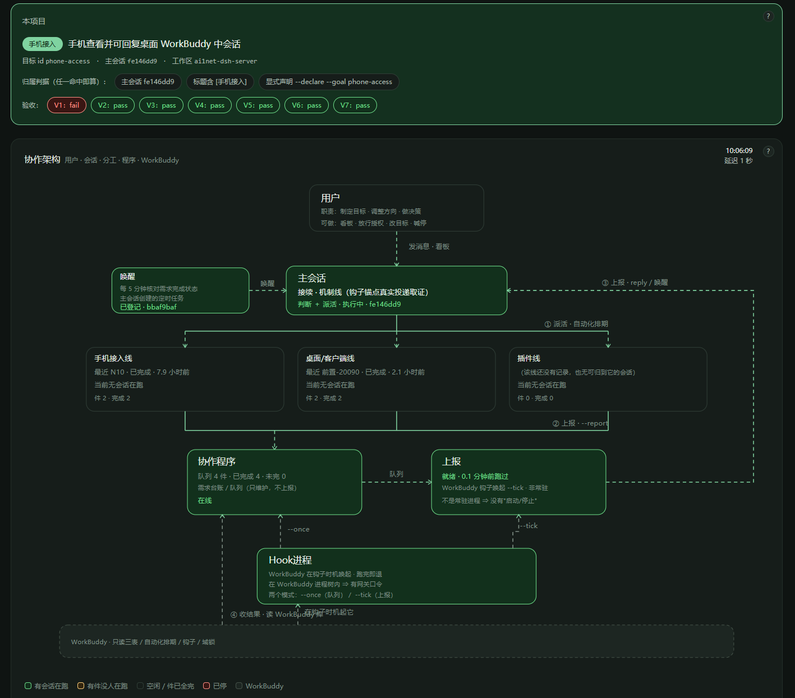

# workbuddy_skills

我自己用的 WorkBuddy 技能，攒一个放一个。

| 技能 | 干什么 |
|---|---|
| [multi-session-collab](multi-session-collab/) | 把一个需求交给一群 AI 会话并行干：进度自己往前推，完成是真完成，出事才找你 |

每个技能目录里有自己的 README，怎么装、哪里有坑都写在里面。
